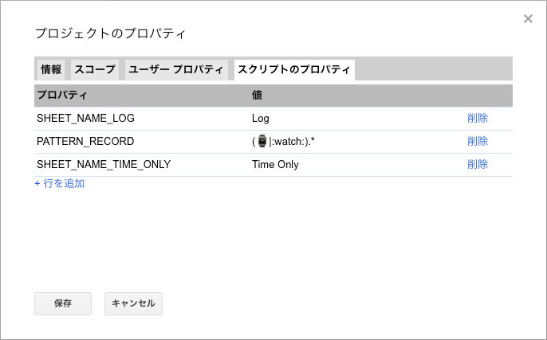
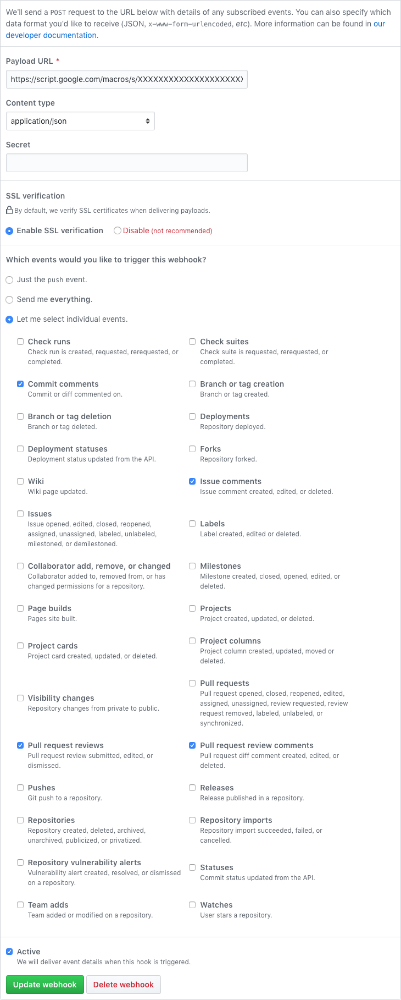
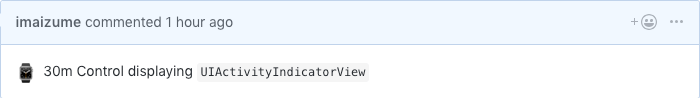
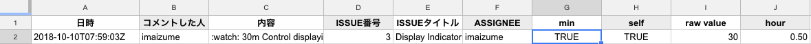
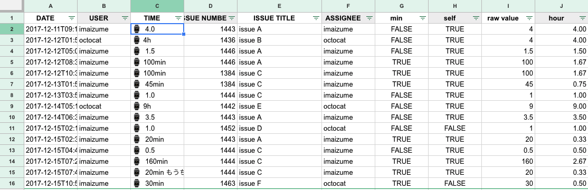
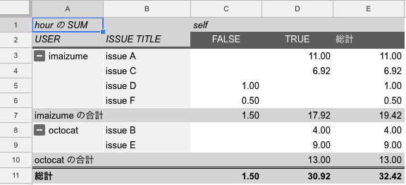

# Github Record Time

A simple GAS which records your working time commented on issue and pull request.

## Usage

1. Create a Google Spreadsheet for time recording.
1. Open script editor then copy `script.gs` or clone this repository using Chrome plugins such as [leonhartX/gas\-github](https://github.com/leonhartX/gas-github)
1. Set following script properties.
  - `SHEET_NAME_LOG` : The name of sheet to record ALL of comment events on github.
  - `SHEET_NAME_TIME_ONLY` : The name of sheet to record ONLY comment that includes expression you specified as `PATTERN_RECORD`. They are counted as time you worked.
  - `PATTERN_RECORD`: A pattern to filter and extract working time from the comments. (e.g. `"(⌚|:watch:).*"`  just leaves comments such as `":watch: 30min"`)
1. Create following sheets.
  - Sheet to record ALL of github comment event. It's name should be same as `SHEET_NAME_LOG`
  - Sheet to record github comment events ONLY inludes expression specified in `PATTERN_RECORD` property. It's name should be same as `SHEET_NAME_TIME_ONLY`
1. Add webhook to your github repo
  - Before go to github, deploy your script as web application from "Publish" > "Deploy as web app" and copy web app URL.
  - Add new webhook from your github repo's setting page.
  - Specify payload url as one you copied just before and content type as "application/json". Secret can be void.
  - Choose "Let me select individual events." and check following types of github event.
    - Commit comments
    - Issue comments
    - Pull request reviews
    - Pull request review comments
1. Now comments on your repo will be recorded to the sheets! To know what kind of data to be recorded, see next section.

## What is Recorded

When you post comment to github issue or pull request, following data is fetched and recorded in specific columns.

| Column Name | What Value Means |
----|----
| date         | Date of event occurence. |
| user         | GitHub user name of commenter. |
| comment/time | Content of comment. / Time you worked. |
| issue number | Issue number comment put. |
| issue title  | Issue title comment put. |
| assignee     | Assignee of the issue. |
| min          | (FORMULA) TRUE if comment has expression to specify unit as minutes. |
| self         | (FORMULA) TRUE if commenter is equal to asignee. |
| raw value    | (FORMULA) Extract numeric expression from the comment. |
| hour         | (FORMULA) Working time converted into hour. If min is TRUE, value devied into 60 will be filled. |

## Note

- By default, number found in expression is recognized as HOUR (e.g. ":watch: 3.0" will be parsed as 3 hours' working). If you want to record in MINUTES, set suffix such as ":watch: 30min"
- Creating pivot table is a good way to know which issue you spend much time. (following is example)
  - ROWS
    - User
    - Issue Title
  - COLUNS
    - Self
  - VALUES
    - Hours

## Example

Below is an example of script properties.

And below is an example of github webhook settings.

When I comment like this:

It will be recorded like this:

If you could gather some amount of records

Let's make a pivot table which clarify your time usage for each tasks!

## Dependency

- Date translation depends on [Moment.js](https://script.google.com/macros/library/versions/d/15hgNOjKHUG4UtyZl9clqBbl23sDvWMS8pfDJOyIapZk5RBqwL3i-rlCo) and import from "Resource" -> "Library"

